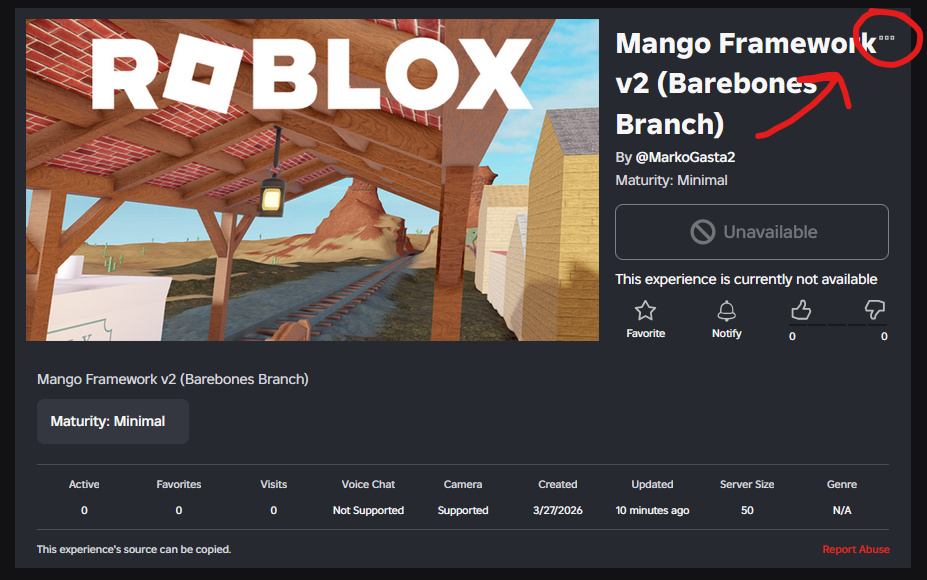
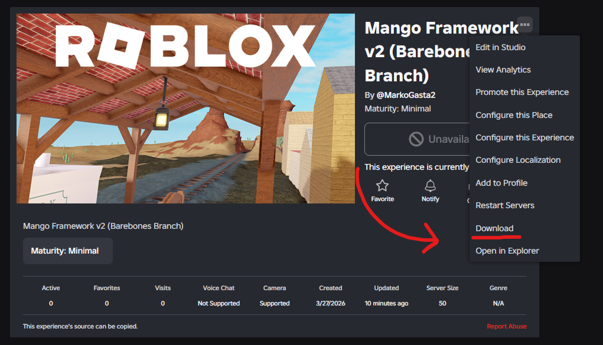

## About
On the other hand, if you prefer working in the Roblox script editor directly you can copy the already built place containing **Mango Framework**

## Downloading
1. Choosing a branch lets you pick what features will come with your download of **Mango Framework**. Each branch has a different set of [branch features](../../docs/branches/main).

2. Select a branch:
    - [Main Branch](https://www.roblox.com/games/89068428424870/Mango-Framework-v2)
    - [Barebones Branch](https://www.roblox.com/games/110037734146798/Mango-Framework-v2)

3. Open the experience options.

4. Download the place.

After downloading the place file, you can open it and publish it under your name. The file should contain the whole framework with the branch of your choosing ready to go.