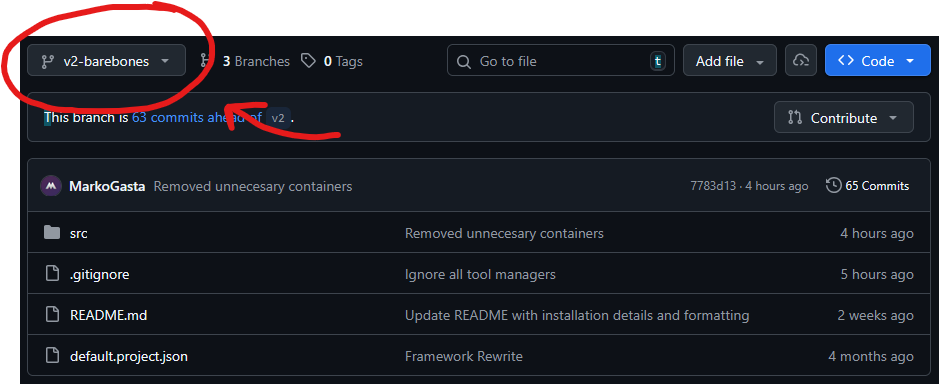
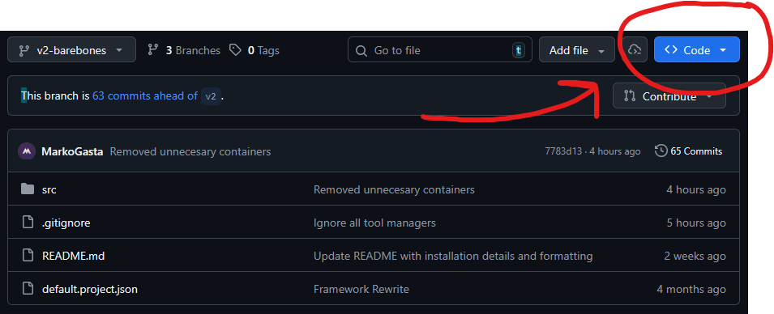
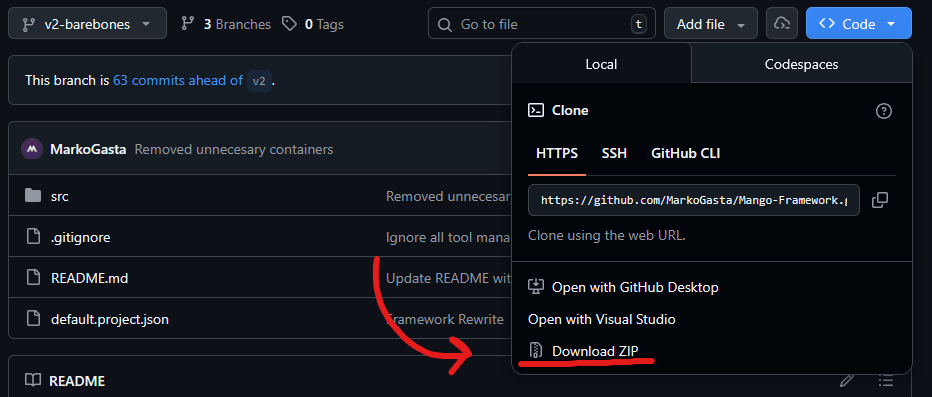

## About
Installing **Mango Framework** from source gives you the greatest amount of flexibility with the system. This is how it was developed and used by myself. To visit the framework source code page click [here](https://github.com/MarkoGasta/Mango-Framework)


## Downloading
### Directly from Github
1. Choosing a branch lets you pick what features will come with your download of **Mango Framework**. Each branch has a different set of [branch features]().


2. Press the Code button in the top right of the repository.


3. Press "Download ZIP" button, which will download the whole repository as a zipped archive.


4. Create a folder, anywhere, that will be your work folder.
5. Unzip the archive into you new work folder.


### With Git
1. Open a terminal
2. Move into the directory that will be the parent directory of your workspace folder.
3. Choose a branch from the [Github repository](https://github.com/MarkoGasta/Mango-Framework).
4. Run:
```bash
git clone -b <BRANCH_NAME> https://github.com/MarkoGasta/Mango-Framework.git
```

## Opening your workspace
After downloading the repository, you can open it Visual Studio Code or your IDE of choice. The workspace should be Rojo ready and work off the bat.