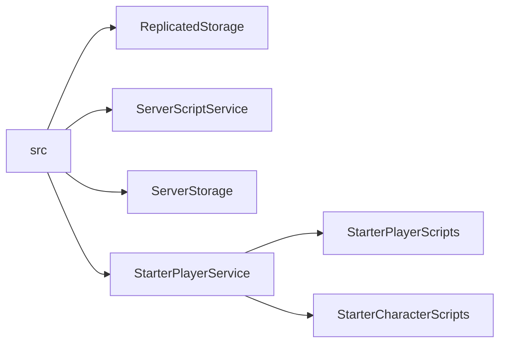

# Top Level Layout
The top level layout of Mango Framework takes inspiration from Roblox services. Each script is a descendant of the folder you can find it in in-studio.

```mermaid
graph LR
    src[src] --> rs[ReplicatedStorage]
    src --> sss[ServerScriptService]
    src --> ss[ServerStorage]
    src --> sps[StarterPlayerService]
    sps --> spls[StarterPlayerScripts]
    sps --> schs[StarterCharacterScripts]
```